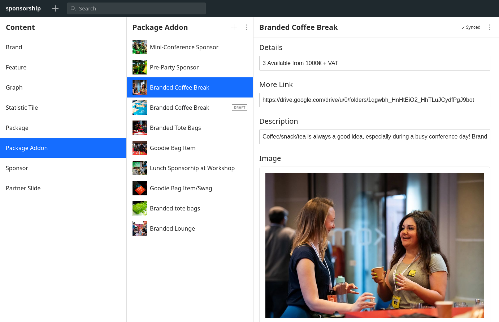
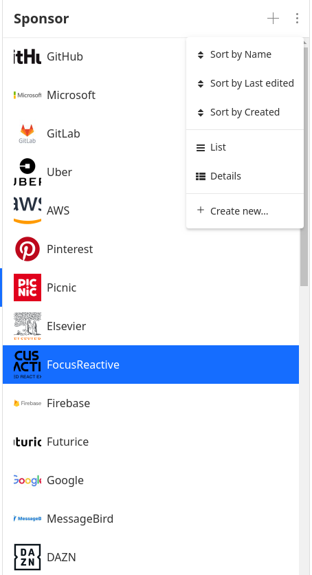
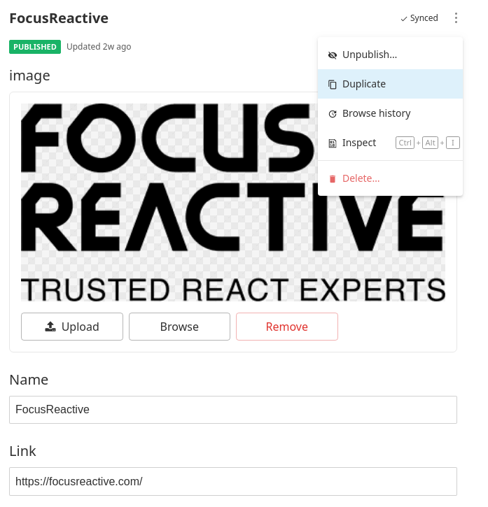
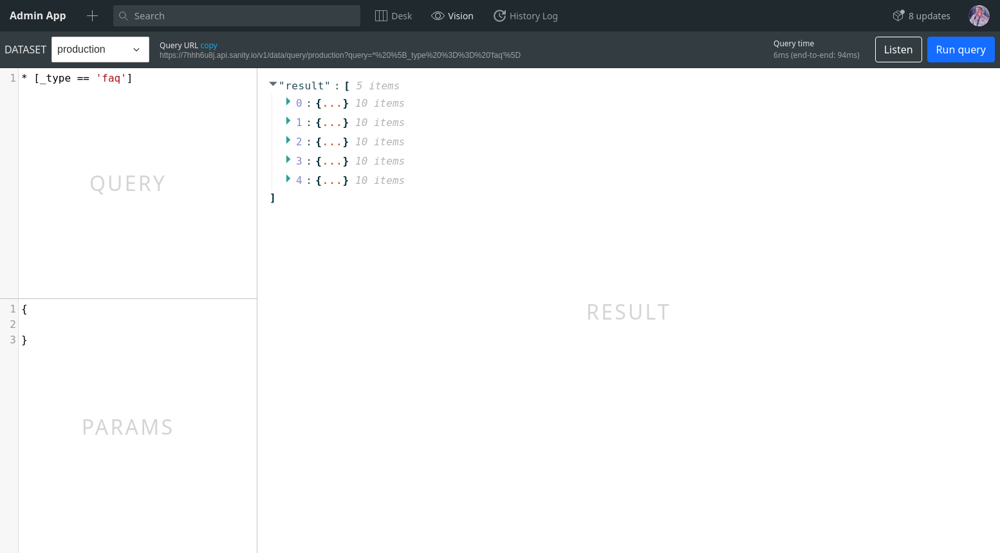

Choosing a technological stack before creating a product we strive to ensure the **speed** of development and the possibility of **customization** to our needs. Often these two requirements are hardly compatible and controversial in their nature. Nevertheless, we strive to select a set of technologies that will allow us to quickly get the result without limiting the flexibility.

In the competition for the ratio of **development speed** to the result **quality**, headless CMS are in a good position. They took the best of traditional BaaS services and old-school CMS. Headless CMS can be described as a **Backend** with a **database** plus the ability to **manage content** without developing a special **admin application**. This frees up our hands regarding the Frontend part and saves time on developing the Backend and administration applications.

However, all ready-to-use solutions have **downsides**. We at FocusReactive have experience working with such Headless CMS as 'Contentful', 'GraphCMS' and 'Sanity'. Each of these CMS offers a good solution “out of the box”, but each one also has its own limitations that we have encountered. One of the weaknesses of Headless CMS is traditionally considered to have **poor admin app customization**. As a rule, it has sufficient functionality for working with content and some options for extending provided by CMS maintainers.

As software developers, we often want to expand this application to our needs. Such a need arises when we have to work with a complex content model and it is necessary to provide editors with the convenience of finding the necessary information and editing it. Of course, we can develop our own application, but then the advantages of using headless CMS are lost compared to just BaaS services.

Different CMSs solve this problem in their own way. E.g. Contentful proposes to extend the standard UI using custom plug-ins. GraphCMS currently only allows you to customize the properties of the documents lists, but we have developed a [Storybook addon](https://github.com/focusreactive/storybook-graphql-kit-graphcms), which you can use to form your own documents outputs based on GraphQL requests. [Read more](https://focusreactive.com/storybook-graphql-kit/) about it if you are interested.


In this post, we want to talk about the customization of **Sanity Studio** - the SPA admin App of that CMS.

Sanity intrigued us from the first glance with its ability to **customize almost everything**. Any Sanity module can be rewritten as a custom one and at the same time it will interact with others within your application. This makes it possible to update only those components that are required while still using the rest of the Sanity functionality as they are.

To manage content, Sanity offers the Sanity Studio - a client site application, the code and settings of which you keep in your Sanity backend project. Sanity Studio can be deployed on any static server, but by default, Sanity provides its own hosting platform - an excellent example of combining customization capabilities and a simple starting solution.

We at FocusReactive offer Sanity as a backend solution to our clients and use it to develop our own applications. If you are interested in how final application can look like, here is an example: https://reactsummit.com/sponsors/

## Sanity Studio Customization

Let's start with how Sanity Studio looks out of the box. The default display style is quite universal and suitable for many cases. It allows you to see the structure of the content, select, view and edit documents. The main part of the application is divided into three columns. The first displays all types of documents available in your scheme. Selecting one of them you will see all available documents of this type in the second column. And finally, choosing a document from the second column, you load it into the editor inside the third section.



You can see - it’s a rather universal structure and in fact is perfect for starting a project. In many cases you won't even need to do anything with it in the future.

So why do we ever might want to change the default display order? I think the most common problem here is that Sanity does not know anything about the hierarchy of different types of documents and displays them in a flat list. While in reality, our documents most likely have a structure with a top and a bottom level of documents.

In our example, Brand objects describe conference information and are the root type. Each brand can have its own set of packages (type Package) and each package can have its own add-ons (type Package Addon). Therefore, for greater convenience, we may want to have such layout in the application:

|          |          |                |          |
| -------- | -------- | -------------- | -------- |
| 1 column | 2 column | 3 column       | 4 column |
| Brands   | Packages | Package Addons | Editor   |
|          |          |                |          |

Thus, in the first column we want to display not document types, but all documents of a certain type. In the second column, we need to display only those documents of type Package that relate to the selected brand, and so on.

Fortunately, Sanity Studio has an excellent API for creating your own layout, which allows you to very flexibly configure the structure of the application we need. In order to add your custom layout to Sanity Studio, you need to specify this in the configuration:

```json
// sanity.json

…

{
     "name": "part:@sanity/desk-tool/structure",
     "path": "./customLayout.js"
 }
…
```

In order to access the methods that control the creation of the layout, let's import them to our file:

```js
// customLayout.js

import S from "@sanity/desk-tool/structure-builder";
```

## Creating own document hierarchy

To have a column with a list of custom elements, create an object using the method `s.list()`
[doc](https://www.sanity.io/docs/structure-builder-reference#list-ab6eb182896e).

You can set the title of that column with `s.list().title(‘ColumnTitle’)`
[doc](https://www.sanity.io/docs/structure-builder-reference#title-3b05a13d35b3).

To display elements, pass an array with them to the `items`
[doc](https://www.sanity.io/docs/structure-builder-reference#items-bc397adb26bd).

**Tip 1:** you can pass a promise to `items` that resolves to an array. This will allow you to make server requests to display components matching to the current condition

**Tip 2:** You don’t need to manually implement the rest right part of the layout displayed when you select an item from the list. You can use the following methods that will do it automatically:

[documentTypeList](https://www.sanity.io/docs/structure-builder-reference#documenttypelist-483661f5b51f) to display all documents of a certain type

[documentList](https://www.sanity.io/docs/structure-builder-reference#documentlist-b317e13b4c73) to display all documents matching the GROQ request.

If you decide to go your own way and have full control of what and how will be displayed, then the next API method you need is `listItem`
[doc](https://www.sanity.io/docs/structure-builder-reference#listitem-4ee70ea3c244). With it, you can specify the behavior of an individual component in the list. Here you can setup the appearance of the element and the behavior of the right side of the application when selecting this element. For this, you need a method `child()` [doc](https://www.sanity.io/docs/structure-builder-reference#child-e6952bebcf5e).

As a child, it usually will be either a nested list or the editing/display form of the corresponding document.

**Tip 3:** note that since the column components are defined by a regular javascript array, all the usual filtering and sorting methods are applicable to it, which gives you additional options for customizing the contents of the columns

## Extending functionality using custom context menu options

By default, Sanity Studio offers a set of contextual commands for manipulating lists and documents. For example, sorting, switching display types, and adding a new component are available for lists.



The document editor also has its own set of commands for publishing, duplicating and viewing details.



We can create our own actions and add them using `menuItem()` [doc](https://www.sanity.io/docs/structure-builder-reference#menuitem-a1762da412c3). To set the operation you should pass a function or `actionHandler` into `action` [doc](https://www.sanity.io/docs/structure-builder-reference#action-25bd65584cea)

## Using own React Components

If the flexibility provided by the API is not enough, you can use your own React components to display documents. To do this, you need to pass the component using the method `document().views([])` [doc](https://www.sanity.io/docs/structure-builder-reference#views-b2337234ea68)
which accepts an array of standard and custom components. Thus, you can even specify several components for displaying a document.
The component itself is passed using the method `component` of object `view()`. Example:
https://www.sanity.io/docs/structure-builder-reference#example-a53abfb93713

In addition to creating your own components for displaying the entire document, you can also create a custom component for working with a specific field of your document within the standard document editor. An excellent description of how this can be done is here:
https://www.sanity.io/guides/how-to-make-a-custom-input-component

## Extending Sanity Studio with plug-ins

So far, we have considered only the part of Sanity Studio that is related to editing content and despite it's extremely flexible it was still limited by the structure consisting of columns and list items. However, in addition to this, Sanity allows you to embed completely arbitrary parts into Studio that can behave like separate applications.



The plugins can use the entire area below the upper toolbars and their capabilities are unlimited. Sanity already has a fairly large set of [plugins](https://www.sanity.io/plugins?category=all) ready for use.

In addition, you can develop your own plugin. This is pretty easy to do. The first steps will be as follows:

- Create a folder inside the plugins/ with the name of your plugin
- Add the plugin name to sanity.json in the plugins section
- Go to the created folder and launch the command in terminal `sanity init plugin`

Now you can develop your plugin. Index.js file must export plugin data:

```js
export default {
  title: "Custom plugin",
  name: "my-custom-plugin",
  icon: Icon,
  component: PluginApp,
};
```

The icon for switching to the plugin will appear on the upper toolbar.

Fetching From Database

When developing custom elements, you will often need to get some information from the backend. You may be tempted to use some external client and target it to your endpoint. However, a more correct solution would be to use the client already built into Sanity

You can import it as follows:
`import client from "part:@sanity/base/client";`

Then you can get the data you need:

```
const groups = await client.fetch(`
    *[_type == "system.group"]
    `);

```

Why is using an embedded client better than external? In addition to reducing bundle volume, it also increases the security of your application. The fact is that to access the database you will need to specify an authorization token in the header. At the same time, you may be tempted to keep this token hardcoded in the application bundle. This is, of course, bad from the security point of view since it gives attackers access to the token. Using the built-in client will avoid this problem.

In addition, the built-in Sanity client allows you to make requests on behalf of the logged user and, thus, your tools will be able to display the required information depending on the access level of a specific user.

## Conclusion

We had the opportunity to compare several Headless CMS and confidently say: "If your project will need the admin panel customization - Sanity is what you need."
