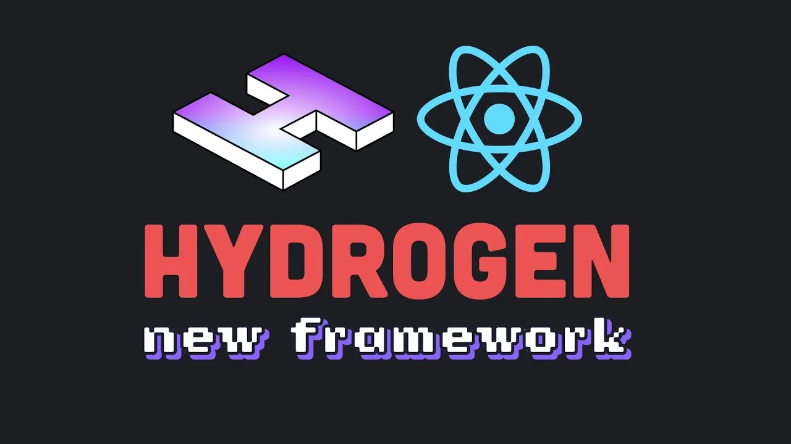

---

title: Content-centric, scalable e-commerce. Shopify Hydrogen + Sanity
description: In June 2022, Shopify released its new framework for working with e-commerce projects. With the goal of making its resources more flexible and open to change, Shopify has created an excellent solution for this - Hydrogen
heroImage: /images/hero/Custom-storefronts.webp
authors: AlexHramovich
tags:
  - Shopify
  - Headless eCommerce
  - Shopify Hydrogen
  - Shopify + Sanity
  - Jamstack
  - React

---

## Introduction
At present we have a lot of solutions on how to run an e-commerce website or platform by our hands. One of the best options is to use [Shopify](https://www.shopify.com/). This platform is at the top of the industry and it has already helped thousands of businesses achieve success. In one day, you can create from scratch everything you need to launch a full-fledged e-commerce platform.

We would like to shed some light on the latest updates of this platform and discuss the strengths and weaknesses of Shopify-based solutions. And we will dive deeper into some  solutions that help us create extremely flexible and powerful e-commerce platforms.

## Strengths and weaknesses of Shopify based products

Shopify is great for creating e-commerce products. Without any programming knowledge, you can get all you need to start your business. You get product logic, shipping, analytics and many other functions out of the box. To learn more about this, it is better to look at the official documentation.

Due to the fact that Shopify provides you with everything described below, it has a strict structure without the possibility of changing it. The structure has proven itself perfectly, but in case you need some kind of individual solution, you may encounter some difficulties and constraints. In fact, you will be limited in creating custom pages or you will need to update your template every time by external developers.

If you want to have a fully customizable, performant and flexible structure created specifically for your project and needs, which will have excellent SEO and speed metrics, as well as be able to create pages with dynamic content without a fixed structure and at the same time use all the features of Shopify, we would like to share with you the latest updates that will help achieve these goals.

## Shopify Hydrogen

In June 2022, Shopify released its new tool (framework) for working with e-commerce projects. With the goal of making its resources more flexible and open to change, Shopify has created an excellent solution for this - [Hydrogen] (https://hydrogen.shopify.dev/). Using this framework, customers can create their own front-end projects based on the Shopify (storefront) API, while maintaining full integration with existing logic. You are no longer limited by templates. Now you can create customized solutions exclusively for your needs. In addition, this framework is ideal for speed metrics with the ability to customize SEO. In fact, the very fact of the release of Hydrogen means that customers can now create fully customizable interfaces. Please check the official documentation if you want to learn more about this tool.

Considering the opportunities offered by Hydrogen, we have an excellent chance to implement flexible resources, however, the content part of shopify, namely the creation of landing pages and marketing pages, still remains limited, since at this stage we received flexibility only from the front-end part of the project, and the user Shopify account itself remained unchanged.

## Shopify + Sanity

To create flexible and content-oriented websites, the usual solution is to use a headless CMS. Thanks to it, we can create unique pages and content for individual brands.

One of the most flexible, if not the most, headless CMS is Sanity. It allows you to create any data structures for any client.

In June 2022, Shopify invested in Sanity. This fact told us that Shopify plans to develop its content part, and they already have an integration with each other. Thanks to this, you can now use the full power of Shopify, while remaining incredibly flexible in terms of content and creating an interface thanks to Hydrogen and Sanity.

Let's share a few examples of this type of integration:
- In the usual case, content-centric resources have their own blog. This is a great place to create and share content with users. Now we have the opportunity to expand its functionality by adding individual products and the ability to purchase them in 1 click. In this version, we have all the flexibility of CMS when writing blog posts, as well as full integration with Shopify to purchase a specific product.
- We can create unique pages for a specific product with incredible loading speed.For example, using advertising on Instagram, we can easily direct the user directly to the purchase page, where the entire interface will already be ready to order, and at the same time the user will receive all the information he needs.
- We are no longer limited to the field of e-commerce, now we can fully develop our resource in different directions, integrating other business ideas, such as data analysis, collecting feedback, analyzing user actions the way we want.
- We have the opportunity to customize SEO individually for ourselves so that search bots see our products and information exactly the way we want. Whether it's product cards or a detailed description

Previously it was impossible or difficult to implement, but now we can create incredibly flexible e-commerce resources that are ready to scale and are not limited by anything. Plus, this type of projects have a very high speed and excellent SEO.
## Conclusion
Shopify has taken a huge step towards the flexibility of its projects. Now everyone has the opportunity to create flexible and powerful projects based on already familiar and established technologies.

**Who might be interested in the integrating of Hydrogen and Sanity?**
If you find that your Shopify project is limited in some part. For example, would you like to be more flexible when creating pages or in general would like to have more control over the interface. Or you are interested in good SEO and site speed combined with some other kind of customization - this is the perfect choice to try. You won't need to change everything that already works in your Shopify account. All you need is to adopt the newly released features.

## Useful likns

[Shopify](https://www.shopify.com) 
[Sanity](https://www.sanity.io) 
[Hydrogen](https://hydrogen.shopify.dev) 
[Sanity & Shopify related article](https://www.sanity.io/blog/build-performant-and-remarkable-storefronts-with-sanity-and-shopify) 
[Demo project from the Sanity team](https://hydrogen-sanity-demo.com) 